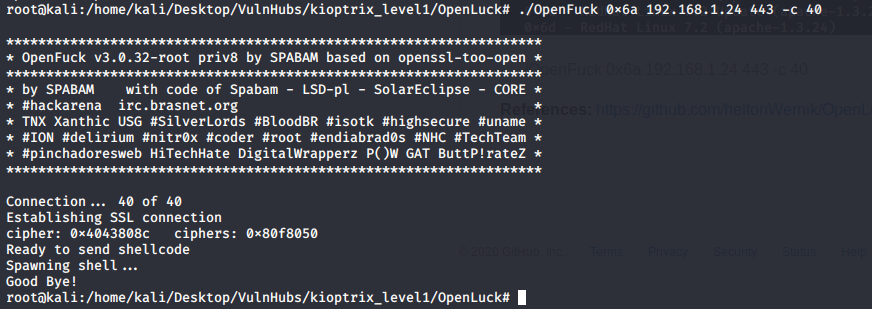

# Summary
This document will walk you through the procedure (step-by-step) to root the machine Kioptrix Level 1.
The Goal is to gain "root" access in the target machine.

**WARNING:** This walk through is to be used for learning/educational purposes only.

**NOTE:**
Kioptrix Level 1 is a vulnerable VM, which will be our target machine.
Kali Linux (2020) is the VM being used to carry out the pentesting, a.k.a. the attacker machine.
Both VMs are being hosted on VM Workstation.

# WalkThrough

**Step 1:**
Turn on the Target Machine. Run netdiscover on local machine (Attacker's) on interface eth0
> netdiscover -i eth0

Target Machine IP found to be `192.168.1.24`

**Step 2:**
Run NMap to scan target machine for open ports. 
> nmap -sC 192.168.1.24

Ports found open: 22, 80, 111, 139, 443, 1024
Port 139 is open, meaning the host has Samba server running. 

**Step 3:**
Run nikto on `192.168.1.24` to locate any points of vulnerabilities.
> nikto -h 192.168.1.24

It is found that the webserver is Apache and the current version(2.8.4) of `mod_ssl` is vulnerable to exploit.

`mod_ssl/2.8.4 - mod_ssl 2.8.7 and lower are vulnerable to a remote buffer overflow which may allow a remote shell. http://cve.mitre.org/cgi-bin/cvename.cgi?name=CVE-2002-0082, OSVDB-756.`

Visit `https://github.com/heltonWernik/OpenLuck` and download the repository zip. It is a C  program designed to exploit the Apache webserver with mod_ssl version less than 2.8.7

**Step 4:**
Compile the file `OpenFuck.c`
> gcc -o OpenFuck OpenFuck.c -lcrypto

Next, run the exploit.
> ./OpenFuck

It will show the list of supported boxes for the target of the exploit. Since we are dealing with Apache version 1.3.20 on the target machine, we choose the box for that version only. Based on the usage text, we set number of channels to 40.

We try the first box `0x6a` and see that we do not get shell access to the target machine.

We try the second box `0x6b` and we are able to access the target machine.

Root Access Acquired!!!

**Step 5:**
Based on Step 1, the host is also running a Samba Server. Known exploit for Samba servers can be found on Metasploit Framework.
We search for the exploit, configure its options and run the exploit.

Root Access Acquired!!!

**References:**
https://github.com/heltonWernik/OpenLuck

