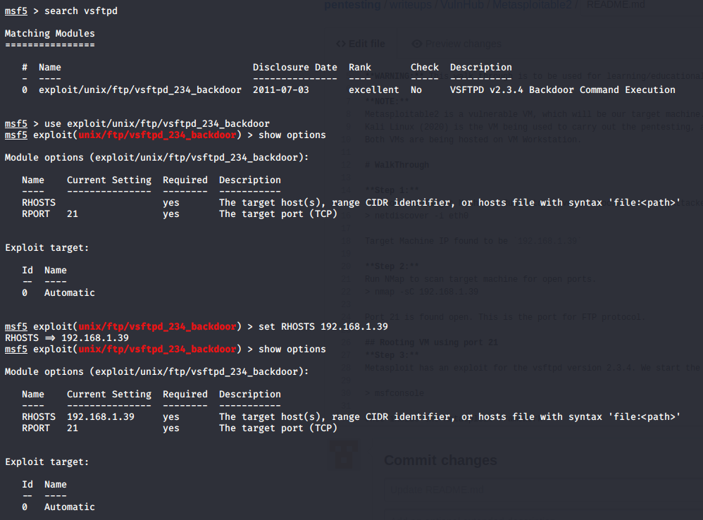
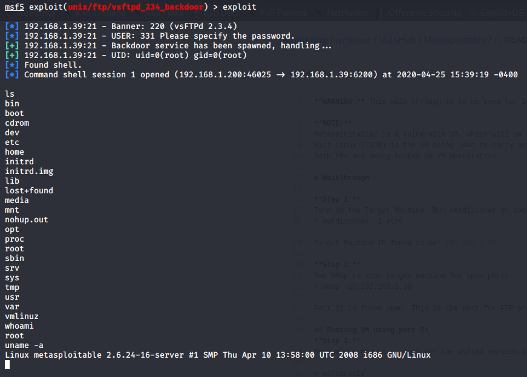
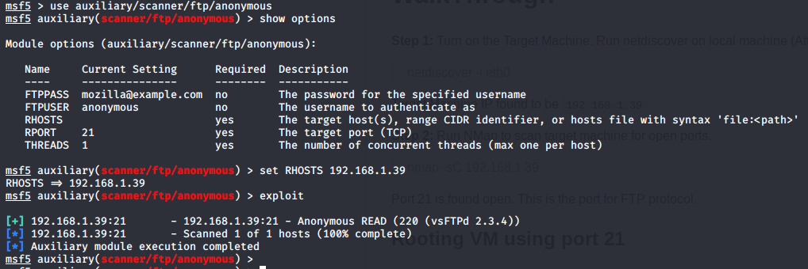
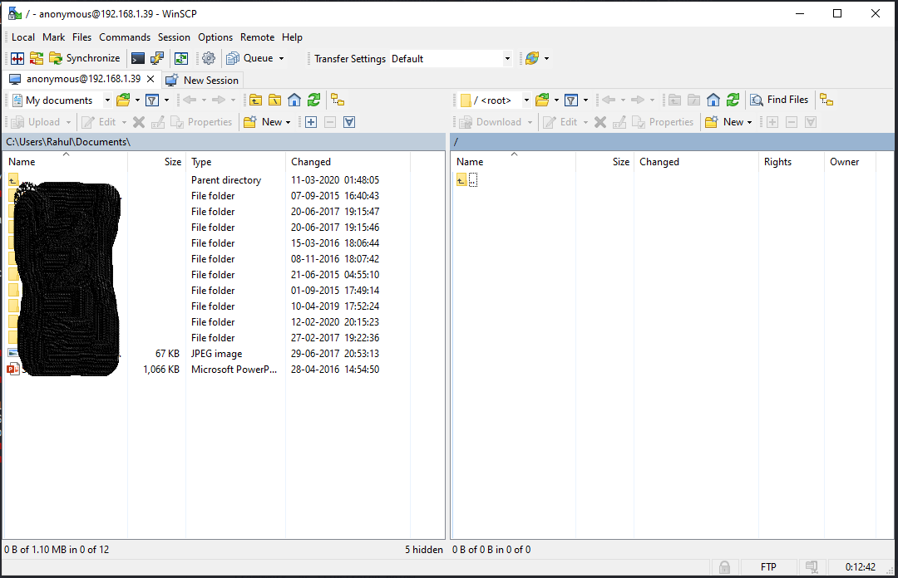

# Summary (INCOMPLETE)
This document will walk you through the procedure (step-by-step) to root the machine Metasploitable2.
The Goal is to get root access in the target machine.

**WARNING:** This walk through is to be used for learning/educational purposes only.

**NOTE:**
Metasploitable2 is a vulnerable VM, which will be our target machine.
Kali Linux (2020) is the VM being used to carry out the pentesting, a.k.a. the attacker machine.
Both VMs are being hosted on VM Workstation.

# WalkThrough

**Step 1:**
Turn on the Target Machine. Run netdiscover on local machine (Attacker's) on interface eth0
> netdiscover -i eth0

Target Machine IP found to be `192.168.1.39`

**Step 2:**
Run NMap to scan target machine for open ports. 
> nmap -sC 192.168.1.39

Port 21 is found open. This is the port for FTP protocol.

### Rooting VM using port 21 (Vsftpd vulnerability)
**Step 3:**
Metasploit has an exploit for the vsftpd version 2.3.4. We start the msfconsole using the following command

> msfconsole

Once inside the Metasploit framework, we search for the `vsftpd` exploit.

Once configured, we run the exploit.

ROOT Access established !!!

### Rooting VM using port 21 (Default Anonymous Configuration)
**Step 4:**
FTP servers allow anonymous connections by default. An attacker can verify this by using an auxiliary exploit from Metasploit Framework, as illustrated below. Link Src - https://shahmeeramir.com/penetration-testing-of-an-ftp-server-19afe538be4b

Once establised that anonymous user can READ from the FTP Server, attacker can use WinScp program to read files using its UI.

**Step 5:**

