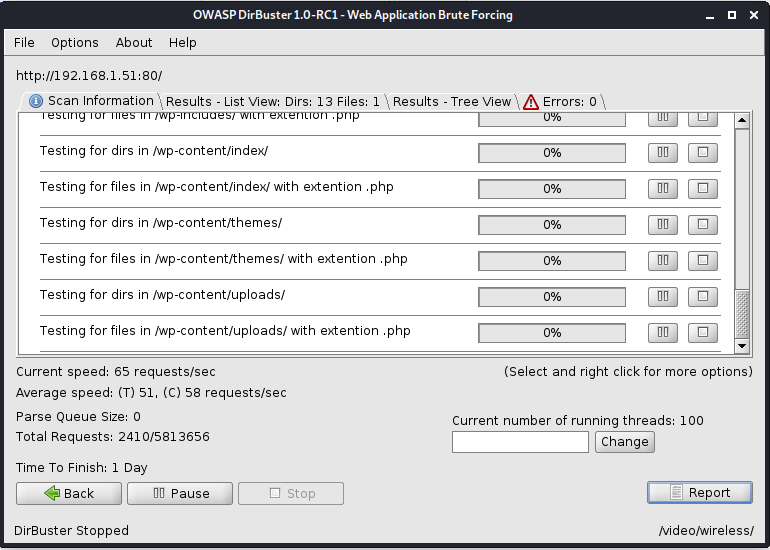
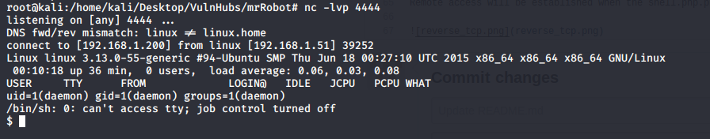
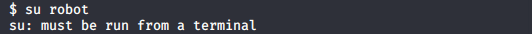
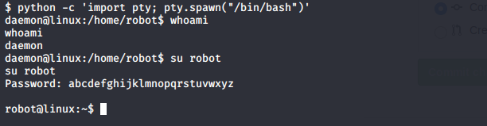
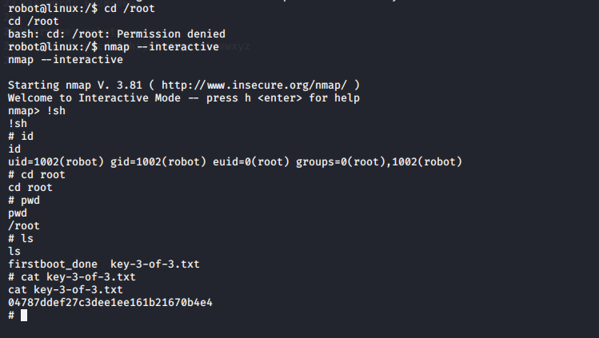

# Summary
This document will walk you through the procedure (step-by-step) to root the machine Mr-Robot.
The Goal is to locate all 3 keys hidden in the target machine.

**WARNING:** This walk through is to be used for learning/educational purposes only.

**NOTE:**
Mr-Robot is a vulnerable VM, which will be our target machine.
Kali Linux (2020) is the VM being used to carry out the pentesting, a.k.a. the attacker machine.
Both VMs are being hosted on VM Workstation.

# WalkThrough

**Step 1:**
Turn on the Target Machine. Run netdiscover on local machine (Attacker's) on interface eth0
> netdiscover -i eth0

Target Machine IP found to be `192.168.1.51`

**Step 2:**
Run NMap to scan target machine for open ports. 
> nmap -sC 192.168.1.51

Port 80 is found open.

**Step 3:**
Run nikto or Burp Suite Spider on `http://192.168.1.51/` to locate any points of vulnerabilities.
> nikto -h http://192.168.1.51/

Found robots.txt. It has entries for `fsocity.dic` and `key-1-of-3.txt`. Lets download them with the following commands.
> wget http://192.168.1.51/key-1-of-3.txt

> wget http://192.168.1.51/fsocity.dic

`key-1-of-3.txt` contains some encrypted text, presumably a key, the first of the 3 keys we are locating.
`fsocity.dic` contains random words, which would indicate that its a wordlist

**Step 4:**
Run `dirbuster` on `http://192.168.1.51`. It would list out the files/folders on the webserver. 

We observe the `wp-content` folder present, which indicates the presence of wordpress component. We explore further to find the login page as well. `http://192.168.1.51/wp-login.php`

**Step 5:**
We guess the credentials for this login page. We observe that the error message is different when the username is guessed correctly. We try various default usernames, or names of characters from the TV show Mr. Robot.

We find that 'elliot' is one of the correct usernames. To guess the password, we think of using the `fsocity.dic` file as a wordlist to bruteforce the password.

Using BurpSuite Intruder or WPScan to bruteforce the password, we find the password to be `ER28-0652`
> wpscan --url http://192.168.1.51/wp-login.php --passwords fsocity.dic --usernames 'elliot'

Login Successful!

**Step 6:**
Once inside, we have to find an entry point to generate a reverse TCP connection between the target and attacker machine. We can use one of the Appearance Theme PHP pages to carry the payload of the attack.

Using the [php_reverse_shell.php](php_reverse_shell.php) in `/usr/share/webshells/php` folder, we use this script as payload content. In this script we change the IP Address to your IP (Attacker's IP) and port number 4444 to listen incoming traffic on.

**Step 7:**
On the local machine, we use netcat to listen to port 443
> nc -lvp 443

Also visit `http://192.168.1.51/themes/404.php`

Remote access will be established when the shell.php.png executes

**Step 8:**
First we will explore the home directory for the user "robot"
> cd /home/robot

We find two files `key-2-of-3.txt` and `password.raw-md5`. 

`password.raw-md5` contains encrypted credentials for the user `robot`.

When trying to read `key-2-of-3.txt`, we are denied permission. We have to login as `robot` in order to be able to read the 2nd key. We should try to decrypt the credentials encrypted by MD5 Encryption.

The password after decryption is `abcdefghijklmnopqrstuvwxyz`

**Step 9:**
When trying to login to `robot` we get the following message.

So we try to spawn a bash shell first, and try logging in with username `robot` and password `abcdefghijklmnopqrstuvwxyz`

**Step 10:**
To get the 3rd key, we must first try to get root access. We first try by logging in as `root` which fails.

We try the privilege escalation appoach using `nmap` which would allow us to get `root` access.

Once we have `root` access, we explore the `/root` folder to locate the 3rd Key.
Mission Accomplished!

