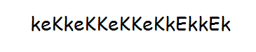

# Summary
This document will walk you through the procedure (step-by-step) to root the machine FristiLeaks.

**WARNING:** This walk through is to be used for learning/educational purposes only.

**NOTE:**
FristiLeaks is a vulnerable VM, which will be our target machine.
Kali Linux (2020) is the VM being used to carry out the pentesting, a.k.a. the attacker machine.
Both VMs are being hosted on VM Workstation.

# WalkThrough

**Step 1:**
Turn on the Target Machine. Machine IP is found to be 192.168.1.28

**Step 2:**
Run NMap to scan target machine for open ports. 
> nmap -sC 192.168.1.28

Port 80 is found open.

**Step 3:**
Run nikto or Burp Suite Spider on http://192.168.1.28/ to locate any points of vulnerabilities.
> nikto -h http://192.168.1.28/

Found robots.txt. It has entries for /cola, /sisi and  /beer. All 3 pages are dead end.

**Step 4:**
Since all 3 entries in robots.txt were drinks, I guessed visiting http://192.168.1.28/fristi, which is also a drink. 
This URL takes us to a page which is the admin portal for FristiLeaks website.

**Step 5:**
Continuing the exploration we view the page source. There are some comments which includes a base64 code.

> echo "base64 code" | base64 --decode > evidence.png 

Once decoded to the .png format, the text in the .png file is found.
There is also a note in the page source, written by someone named "eezeepz".

Attemmpting admin login with username "eezeepz" and password "keKkeKKeKKeKkEkkEk" (text in the png file). Login is successful!!

**Step 6:**
After successful login, we land on the upload page. When trying to upload a random file, the page prompts that acceptable formats are gif, jpg and png only. When the file is uploaded it can be viewed on /fristi/uploads/filename.png

In order to acquire shell access to target machine, we decide to implement reverse_tcp attack. 
Using the [php_reverse_shell.php](php_reverse_shell.php) in /usr/share/webshells/php folder, we use this script as payload.
In this script we change the IP Address to your IP (Attacker's IP) and port number 443 to listen incoming traffic on.
We rename the file as shell.php.png so that it can be uploaded without error.

**Step 7:**
On the local machine, we use netcat to listen to port 443
> nc -lvp 443

Also visit http://192.168.1.28/fristi/uploads/shell.php.png

Remote access will be established when the shell.php.png executes

  
**Step 8:**
First we will explore the home directory for the user "eezeepz"
> cd /home/eezeepz

We find a file notes.txt which looks interesting

This means any command in `/tmp/runthis` would get executed. We will write commands to this file to get access to `/home/admin`

**Step 9:**
To obtain access to `/home/admin` we need to change its access privileges
> chmod -R 777 /home/admin

We come across this error `command did not start with /home/admin or /usr/bin`

To bypass this we will use the following command
> echo "/home/admin/chmod -R 777 /home/admin" . /tmp/runthis

To check whether we get admin access, try `cd /home/admin`. We should see the following image.

  

