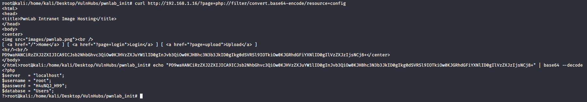
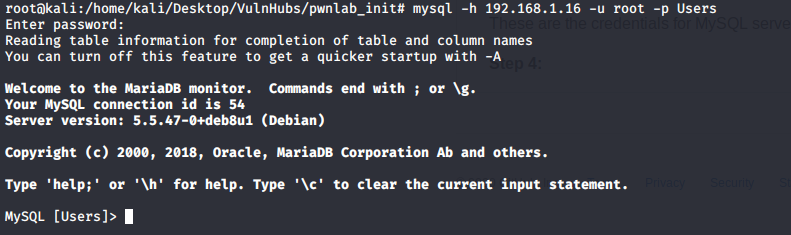
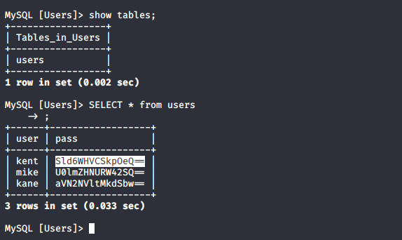

# Summary
This document will walk you through the procedure (step-by-step) to root the machine pwnlab_init.
The Goal is to locate the flag hidden in the target machine.

**WARNING:** This walk through is to be used for learning/educational purposes only.

**NOTE:**
Pwnlab:Init is a vulnerable VM, which will be our target machine.
Kali Linux (2020) is the VM being used to carry out the pentesting, a.k.a. the attacker machine.
Both VMs are being hosted on VM Workstation.

# WalkThrough

**Step 1:**
Turn on the Target Machine. Run netdiscover on local machine (Attacker's) on interface eth0
> netdiscover -i eth0

Target Machine IP found to be `192.168.1.16`

**Step 2:**
Run NMap to scan target machine for open ports. 
> nmap -sC 192.168.1.16

Port 80 is found open.

**Step 3:**
Explore http://192.168.1.16/. There are several links. We observe that the URL changes when clicking on the links
- `http://192.168.1.16/?page=home` when on `home`
- `http://192.168.1.16/?page=login` when on `login`
- `http://192.168.1.16/?page=upload` when on `upload`

This means that the website is susceptible to LFI (Local File Inclusion) Attack. We will exploit this vulnerability to get content of other files. 

Changing the URL to `http://192.168.1.16/?page=php://filter/convert.base64-encode/resource=config` will fetch us the base64 encoded content of the file `config.php`

These are the credentials for MySQL server on http://192.168.1.16/

**Step 4:**
Once the MySQL credentials are obtained, we login to MySQL Server using those credentials

We explore the MySQL database tables, and check the `users` table for critical information.

We have obtained user credentials which can be used to login to the web application. They are base64 encoded, and after decoding store them in [users.txt](users.txt) file.

Using one of the user credentials `kent`, we login to the application.

**Step 5:**

