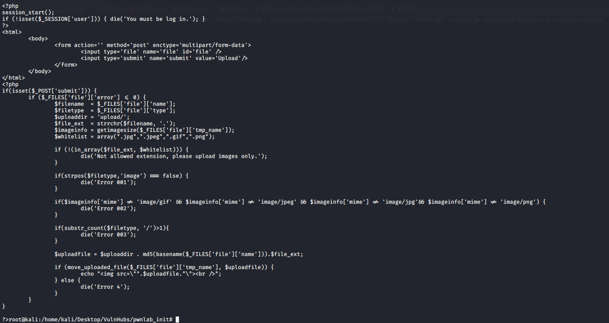
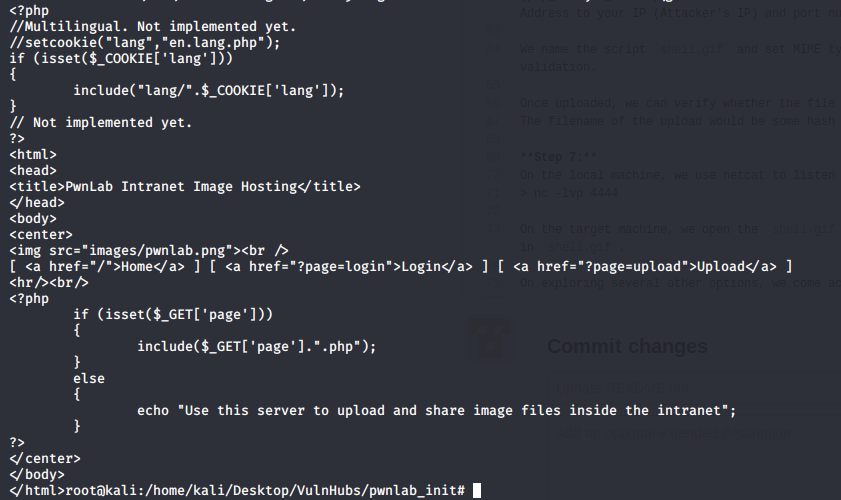
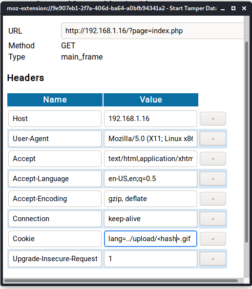

# Summary
This document will walk you through the procedure (step-by-step) to root the machine pwnlab_init.
The Goal is to locate the flag hidden in the target machine.

**WARNING:** This walk through is to be used for learning/educational purposes only.

**NOTE:**
Pwnlab:Init is a vulnerable VM, which will be our target machine.
Kali Linux (2020) is the VM being used to carry out the pentesting, a.k.a. the attacker machine.
Both VMs are being hosted on VM Workstation.

# WalkThrough

**Step 1:**
Turn on the Target Machine. Run netdiscover on local machine (Attacker's) on interface eth0
> netdiscover -i eth0

Target Machine IP found to be `192.168.1.16`

**Step 2:**
Run NMap to scan target machine for open ports. 
> nmap -sC 192.168.1.16

Port 80 is found open.

**Step 3:**
Explore `http://192.168.1.16/`. There are several links. We observe that the URL changes when clicking on the links
- `http://192.168.1.16/?page=home` when on `home`
- `http://192.168.1.16/?page=login` when on `login`
- `http://192.168.1.16/?page=upload` when on `upload`

This means that the website is susceptible to LFI (Local File Inclusion) Attack. We will exploit this vulnerability to get content of other files. 

Changing the URL to `http://192.168.1.16/?page=php://filter/convert.base64-encode/resource=config` will fetch us the base64 encoded content of the file `config.php`

These are the credentials for MySQL server on `http://192.168.1.16/`

**Step 4:**
Once the MySQL credentials are obtained, we login to MySQL Server using those credentials

We explore the MySQL database tables, and check the `users` table for critical information.

We have obtained user credentials which can be used to login to the web application. They are base64 encoded, and after decoding store them in [users.txt](users.txt) file.

Using one of the user credentials `kent`, we login to the application. Login Successful!

**Step 5:**
Once inside, we check the `/home`, `/login`, and `/upload` pages. 

To get a better understanding of the upload functionality we fetch the `upload.php` file.
> curl http://192.168.1.16/?page=php://filter/convert.base64-encode/resource=upload

After doing the base64 decoding operation, we get the following

Based on the logic it is clear that the payload we upload should have `jpg/gif/png` extension, MIME type should match and should not have multiple formats like `shell.php.png`.

**Step 6:**
In order to acquire shell access to target machine, we decide to implement reverse_tcp attack. Using the [php_reverse_shell.php](php_reverse_shell.php) in `/usr/share/webshells/php` folder, we use this script as payload. In this script we change the IP Address to your IP (Attacker's IP) and port number 4444 to listen incoming traffic on.

We name the script `shell.gif` and set MIME type as GIF 98 on the first line of the script. We do this to bypass upload validation.

Once uploaded, we can verify whether the file was uploaded correctly by visiting `http://192.168.1.16/upload/`.
The filename of the upload would be some hash of the filename. 

**Step 7:**
On the local machine, we use netcat to listen to port 4444
> nc -lvp 4444

On the target machine, we open the `shell.gif` we uploaded previously. But we observe that does not execute the script embedded in `shell.gif`.

On exploring several other options, we come across `/index.php` which uses a `lang` cookie.

We can use this `lang` cookie to execute the `shell.gif` script. Enabling TamperData browser extension, we visit `http://192.168.1.16/?page=index.php`. The TamperData prompt opens the request for us to tamper with. 

**Step 8:**

